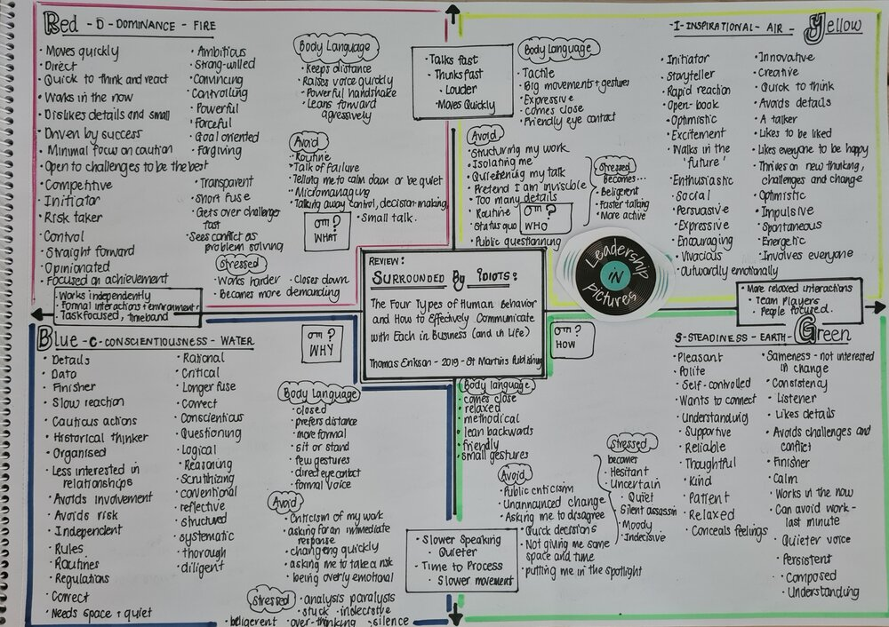

links:

1. [amazon link](https://www.amazon.com/Surrounded-Idiots-Behavior-Effectively-Communicate/dp/1250179947)
2. [review](https://leadershipinpictures.com/blog/review-surrounded-by-idiots-the-four-types-of-human-behavior-and-how-to-effectively-communicate-with-each-in-business-and-in-life-thomas-erikson-2019-st-martins-publishing)

This book explains 4 different personality types and how they like to work, communicate and interact with others.

See image from Ref 2. 

