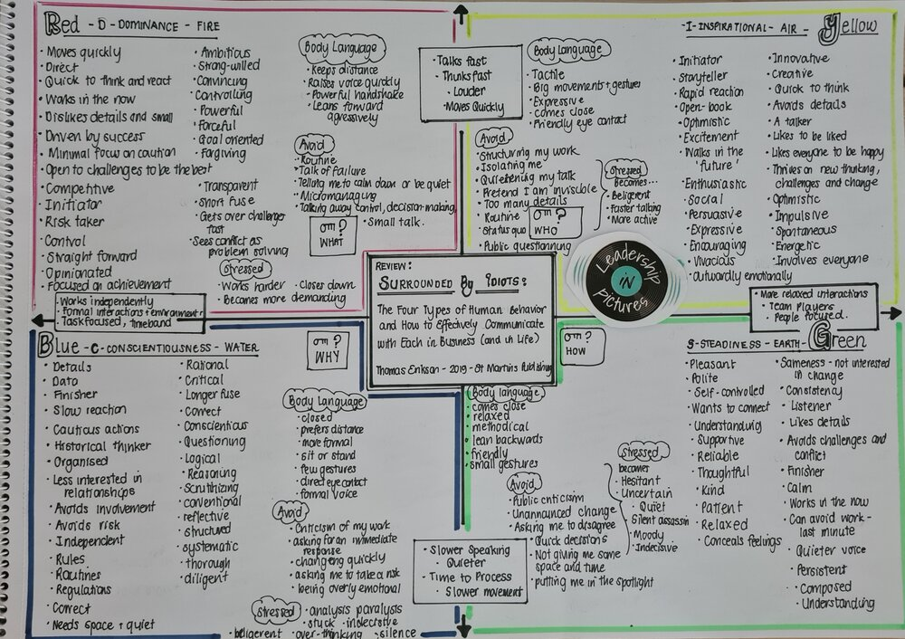

# Surrounded by Idiots: The Four Types of Human Behavior and How to Effectively Communicate with Each in Business (and in Life), Thomas Erikson

This book describes the different communication styles between different people


```
          goal oriented
  BLUE           |       RED
                 |    
introverted______|______extroverted
                 |    
 GREEN           |       YELLOW
                 |       
         relaitionship oriented
```


According to the author most people fall into two quadrants of communication styles depending from their level of introverted/extroverted and goal/relaitionship orientation

Types:

- red/anger/fire: driven individuals who get easily angry. They are good at finishing tasks by can hurt other people's emotions with their strong temperament
- yellow/wind: charismatic individuals who like to talk about ideas, making friends and move around
- blue/water: detailed oriented, who don't talk much but that you should pay attention to what they say when they do. They make great engineers.
- Green/earth: make sure people get along well, they are the best mediators.


Most people fall into the green/earth category 

links:

1. [amazon link](https://www.amazon.com/Surrounded-Idiots-Behavior-Effectively-Communicate/dp/1250179947)
2. [review](https://leadershipinpictures.com/blog/review-surrounded-by-idiots-the-four-types-of-human-behavior-and-how-to-effectively-communicate-with-each-in-business-and-in-life-thomas-erikson-2019-st-martins-publishing)

This book explains 4 different personality types and how they like to work, communicate and interact with others.

See image from Ref 2. 



